# YOLOv8 MLOps on AWS EKS

A production-ready MLOps implementation for deploying YOLOv8 object detection as a scalable web application on AWS EKS with complete CI/CD automation.

## Overview

This project demonstrates a complete MLOps workflow for deploying a machine learning application using:
- **YOLOv8** for real-time object detection
- **AWS EKS** for Kubernetes orchestration
- **Terraform** for Infrastructure as Code
- **Helm** for application deployment
- **GitHub Actions** for CI/CD automation
- **HTTPS** with automated TLS certificates

## Architecture

```mermaid
graph TB
    User[👤 User Browser]
    
    User -->|HTTPS/TLS| Route53[🌐 Route 53 DNS<br/>ml.yourdomain.com]
    
    Route53 --> NLB[⚖️ Network Load Balancer<br/>Created by Ingress Controller]
    
    NLB --> EKS[AWS EKS Cluster]
    
    subgraph EKS["☸️ AWS EKS Cluster"]
        Ingress[🚪 Nginx Ingress Controller]
        
        Ingress --> FrontendSvc[Frontend Service<br/>ClusterIP]
        Ingress --> BackendSvc[Backend Service<br/>ClusterIP]
        
        FrontendSvc --> FrontendPods[📦 Frontend Pods x2<br/>React UI]
        BackendSvc --> BackendPods[📦 Backend Pods x2<br/>Flask + YOLOv8]
        
        ExternalDNS[🔗 ExternalDNS<br/>Manages Route53 records]
        CertManager[🔐 Cert-Manager<br/>Manages TLS certificates]
        HPA[📊 Horizontal Pod Autoscaler<br/>Scales based on load]
    end
    
    style User fill:#4A90E2,stroke:#2E5C8A,stroke-width:2px,color:#fff
    style Route53 fill:#FF9900,stroke:#CC7A00,stroke-width:2px,color:#fff
    style NLB fill:#FF9900,stroke:#CC7A00,stroke-width:2px,color:#fff
    style EKS fill:#326CE5,stroke:#1E4B99,stroke-width:3px,color:#fff
    style Ingress fill:#67C23A,stroke:#4F9C2E,stroke-width:2px,color:#fff
    style FrontendSvc fill:#E6A23C,stroke:#C8882A,stroke-width:2px,color:#fff
    style BackendSvc fill:#E6A23C,stroke:#C8882A,stroke-width:2px,color:#fff
    style FrontendPods fill:#909399,stroke:#73767A,stroke-width:2px,color:#fff
    style BackendPods fill:#909399,stroke:#73767A,stroke-width:2px,color:#fff
    style ExternalDNS fill:#67C23A,stroke:#4F9C2E,stroke-width:2px,color:#fff
    style CertManager fill:#67C23A,stroke:#4F9C2E,stroke-width:2px,color:#fff
    style HPA fill:#67C23A,stroke:#4F9C2E,stroke-width:2px,color:#fff
```



## 📸 Screenshots & Documentation

Visual proof of the complete working deployment across all AWS services.

### 🎨 Working Application

<div align="center">

#### Object Detection - Multiple Classes


*YOLOv8 detecting cat (89.77%), dog (81.96%), and chair (39.55%) with accurate bounding boxes*

<br/>

#### People Detection


*Real-time detection of multiple people with 90%+ confidence scores*

</div>

---

### ☸️ Kubernetes Deployment

<div align="center">

#### Successful Deployment Status


*All pods running with zero restarts, services exposed, ingress configured*

</div>

**Deployment Summary:**
- ✅ 4 Application Pods (2 backend + 2 frontend) - Running
- ✅ 2 Services (ClusterIP) - Active
- ✅ 2 Deployments (2/2 ready) - Healthy
- ✅ 2 HorizontalPodAutoscalers - Configured
- ✅ Ingress with Load Balancer - Active
- ✅ Certificate Provisioning - In Progress

---

### 🔷 AWS EKS Infrastructure

<div align="center">

#### EKS Cluster Overview


*Production EKS cluster running Kubernetes 1.28*

<br/>

#### Worker Nodes


*2 worker nodes (t3.medium) in Ready status across multiple AZs*

<br/>

#### All Running Pods


*15 total pods including application and system components*

<br/>

#### EKS Add-ons


*VPC CNI, kube-proxy, and CoreDNS add-ons all active*

</div>

**EKS Configuration:**
- Cluster Version: 1.28
- Node Type: t3.medium
- Scaling: 1-4 nodes (currently 2)
- Availability Zones: 3 (us-east-1a, 1b, 1c)
- Add-ons: VPC CNI, kube-proxy, CoreDNS

---

### 🗄️ Terraform State Backend

<div align="center">

#### DynamoDB Lock Table


*State locking to prevent concurrent Terraform operations*

<br/>

#### S3 State Storage


*Centralized Terraform state in encrypted S3 bucket*

</div>

**State Management:**
- S3 Bucket: `yolov8-mlops-tf-state-*`
- DynamoDB Table: `yolov8-mlops-tf-lock`
- Encryption: AES-256
- Versioning: Enabled
- State File: 148.3 KB

---

### 🌐 Network & DNS

<div align="center">

#### VPC Configuration


*Multi-AZ VPC with 6 subnets (3 public + 3 private)*

<br/>

#### Route53 Hosted Zone


*Public DNS zone for alistechlab.click domain*

<br/>

#### DNS Records


*ExternalDNS automatically managing A and TXT records*

</div>

**Network Details:**
- VPC CIDR: 10.0.0.0/16
- Availability Zones: 3
- Public Subnets: 3 (for load balancers)
- Private Subnets: 3 (for EKS nodes)
- NAT Gateways: 3 (one per AZ)
- Route Tables: 5
- DNS: Route53 with ExternalDNS automation

---

### 🏗️ Architecture Diagram

<div align="center">


*Complete MLOps infrastructure on AWS EKS*
</div>

**Architecture Components:**

#### Frontend Layer
- **Users** → Browser access via HTTPS
- **DNS** → Route53 with automated record management
- **Load Balancer** → AWS Network Load Balancer
- **Ingress** → Nginx Ingress Controller with SSL termination

#### Application Layer
- **Frontend** → React UI (2 replicas, HPA enabled)
- **Backend** → Flask API + YOLOv8 (2 replicas, HPA enabled)
- **Services** → ClusterIP services for internal routing

#### Infrastructure Layer
- **Compute** → EKS managed node groups (t3.medium)
- **Network** → VPC with public/private subnets across 3 AZs
- **Storage** → ECR for images, S3 for state, EBS for volumes
- **DNS** → Route53 + ExternalDNS for automation
- **SSL** → Cert-Manager + Let's Encrypt

#### Automation Layer
- **IaC** → Terraform with S3 backend + DynamoDB locking
- **CI/CD** → GitHub Actions with OIDC authentication
- **GitOps** → Helm for application deployment

---

### 📊 Infrastructure Metrics

#### Application Statistics
| Metric | Value | Status |
|--------|-------|--------|
| Application URL | https://ml.alistechlab.click | ✅ Live |
| Total Pods | 15 | ✅ Running |
| Application Pods | 4 (2 frontend + 2 backend) | ✅ Running |
| System Pods | 11 | ✅ Running |
| Pod Restarts | 0 | ✅ Stable |
| Response Time | <100ms | ✅ Fast |
| Detection Accuracy | 80-95% | ✅ High |

#### Infrastructure Resources
| Component | Details | Status |
|-----------|---------|--------|
| EKS Cluster | Kubernetes 1.28 | ✅ Active |
| Worker Nodes | 2x t3.medium | ✅ Ready |
| Availability Zones | 3 (us-east-1a/b/c) | ✅ Multi-AZ |
| VPC | 10.0.0.0/16 | ✅ Available |
| Subnets | 6 (3 public + 3 private) | ✅ Active |
| NAT Gateways | 3 | ✅ Active |
| Load Balancer | Network LB | ✅ Active |
| DNS Zone | alistechlab.click | ✅ Active |
| DNS Records | 3 (A + TXT) | ✅ Configured |

#### Storage & State
| Resource | Details | Status |
|----------|---------|--------|
| S3 State Bucket | yolov8-mlops-tf-state-* | ✅ Active |
| State File Size | 148.3 KB | ✅ Healthy |
| DynamoDB Lock | yolov8-mlops-tf-lock | ✅ Active |
| ECR Repositories | 2 (frontend + backend) | ✅ Active |

---

### 🎯 Deployment Verification

Verify all components are working:

```bash
# 1. Check cluster connectivity
kubectl cluster-info

# 2. Verify all resources
kubectl get all,ingress,certificate -n yolov8

# 3. Check node status
kubectl get nodes

# 4. Test backend health
curl https://ml.alistechlab.click/health
# Expected: {"status":"ok"}

# 5. Check pod logs
kubectl logs -n yolov8 -l app.kubernetes.io/component=backend --tail=20

# 6. Watch pod status
kubectl get pods -n yolov8 -w

# 7. Check certificate status
kubectl get certificate -n yolov8
# Expected: Ready: True (after 2-5 minutes)

# 8. Verify DNS resolution
nslookup ml.alistechlab.click

# 9. Test application
open https://ml.alistechlab.click
```

**Expected Results:**
- ✅ All pods in `Running` state
- ✅ Deployments showing `2/2` ready
- ✅ Ingress has load balancer address
- ✅ Health endpoint returns `{"status":"ok"}`
- ✅ DNS resolves to load balancer IP
- ✅ Application accessible via browser
- ✅ Object detection working

---

## Data Flow

1. **User uploads image** → Frontend (React UI)
2. **Frontend sends POST request** → `/predict` endpoint
3. **Backend receives image** → Flask API
4. **YOLOv8 processes image** → Object detection
5. **Results returned to frontend** → JSON with bounding boxes
6. **Frontend displays results** → Visual overlay on image

## Project Structure

```
.
├── app/
│   ├── backend/              # Flask API with YOLOv8
│   │   ├── Dockerfile
│   │   ├── app.py
│   │   ├── requirements.txt
│   │   └── models/
│   └── frontend/             # React UI
│       ├── Dockerfile
│       ├── index.html
│       ├── app.js
│       ├── styles.css
│       └── server.js
├── infra/                    # Terraform Infrastructure
│   ├── main.tf
│   ├── variables.tf
│   ├── outputs.tf
│   ├── provider.tf
│   └── modules/
│       ├── vpc/              # VPC, Subnets, NAT
│       ├── eks/              # EKS Cluster, Node Groups
│       ├── ecr/              # Container Registries
│       ├── route53/          # DNS Management
│       └── helm/             # Nginx, ExternalDNS, Cert-Manager (Let's Encrypt)
├── charts/
│   └── yolov8/               # Helm Chart for Application
│       ├── Chart.yaml
│       ├── values.yaml
│       └── templates/
│           ├── backend-deployment.yaml
│           ├── frontend-deployment.yaml
│           ├── ingress.yaml
│           └── ...
└── .github/
    └── workflows/            # CI/CD Pipelines
        ├── build-and-push.yml
        ├── terraform.yml
        └── deploy-app.yml
```

## Prerequisites

### Required Tools
- **AWS CLI** (v2.x)
- **Terraform** (>= 1.5.0)
- **kubectl** (>= 1.28)
- **Helm** (>= 3.13)
- **Docker** (for local testing)
- **Git**

### AWS Requirements
- AWS Account with appropriate permissions
- Route 53 hosted zone for your domain
- AWS credentials configured

### GitHub Requirements
- GitHub repository
- GitHub Actions enabled
- Required secrets configured (see below)

## Quick Reference

### Automated Deployment (3 Commands)

For the fastest deployment experience:

```bash
# 1. Initial setup and bootstrap
./scripts/setup.sh

# 2. Deploy infrastructure
cd infra && terraform init && terraform apply

# 3. Build and deploy application
cd .. && ./scripts/deploy.sh
```

See detailed instructions below for step-by-step guidance.

## Getting Started

### Deployment Options

This project provides two approaches for deployment:

**🚀 Automated Setup (Recommended)**
- Use `./scripts/setup.sh` for interactive configuration
- Use `./scripts/deploy.sh` for automated deployment
- Best for quick starts and consistent deployments

**🔧 Manual Setup (Advanced)**
- Follow step-by-step instructions below
- Best for learning and customization
- Provides full control over each component

### Step 0: Bootstrap State Backend (FIRST TIME ONLY)

Before deploying any infrastructure, you must create the Terraform state backend. This is a one-time setup.

**Option 1: Combined Setup Script (Recommended)**
```bash
./scripts/setup.sh
# This script will:
# - Validate prerequisites (AWS CLI, Terraform, kubectl, Helm, Docker)
# - Prompt for configuration (domain, region, project name)
# - Offer to run bootstrap automatically
# - Create .env file with your configuration
# - Create infra/terraform.tfvars with infrastructure settings
```

**Option 2: Standalone Bootstrap**
```bash
./scripts/bootstrap.sh
# This creates:
# - S3 bucket for Terraform state storage
# - DynamoDB table for state locking
# - IAM policy for state access
# - Outputs backend configuration for provider.tf
```

**Option 3: Manual Bootstrap**
```bash
cd infra/bootstrap
terraform init
terraform apply
```

**Important:** After running bootstrap, update `infra/provider.tf` with the backend configuration output from the bootstrap script.

See `infra/bootstrap/README.md` for detailed instructions.

### Step 1: Configure AWS and Domain

1. **Create Route 53 Hosted Zone**
   ```bash
   aws route53 create-hosted-zone --name yourdomain.com --caller-reference $(date +%s)
   ```

2. **Update domain nameservers** with your registrar using Route 53 NS records

### Step 2: Configure Environment

**If you used `./scripts/setup.sh`:** Your `.env` and `terraform.tfvars` files are already created. Skip to Step 3.

**Manual Configuration:**

1. **Create and configure .env file**
   ```bash
   cp .env.example .env
   ```

   Edit `.env` with your values:
   ```bash
   DOMAIN_NAME=yourdomain.com
   AWS_REGION=us-east-1
   PROJECT_NAME=yolov8-mlops
   ACCOUNT_ID=123456789012  # Your AWS account ID
   ```

2. **Create Terraform variables file**
   ```bash
   cat > infra/terraform.tfvars <<EOF
   aws_region  = "us-east-1"
   environment = "production"
   project_name = "yolov8-mlops"

   vpc_cidr           = "10.0.0.0/16"
   availability_zones = ["us-east-1a", "us-east-1b", "us-east-1c"]

   cluster_version          = "1.28"
   node_group_instance_types = ["t3.medium"]
   node_group_desired_size  = 2
   node_group_min_size      = 1
   node_group_max_size      = 4

   domain_name = "yourdomain.com"
   subdomain   = "ml"

   backend_image_tag  = "latest"
   frontend_image_tag = "latest"
   EOF
   ```

3. **Update `infra/provider.tf`** backend configuration with the values from bootstrap output:
   ```hcl
   backend "s3" {
     bucket         = "your-state-bucket-name"  # From bootstrap output
     key            = "terraform.tfstate"
     region         = "us-east-1"
     encrypt        = true
     dynamodb_table = "your-lock-table-name"    # From bootstrap output
   }
   ```

### Step 3: Deploy Infrastructure

1. **Initialize Terraform**
   ```bash
   cd infra
   terraform init
   ```

2. **Review the plan**
   ```bash
   terraform plan
   ```

3. **Apply the infrastructure**
   ```bash
   terraform apply
   ```

   This will create:
   - VPC with public/private subnets across 3 AZs
   - EKS cluster with managed node group
   - ECR repositories for backend and frontend
   - Nginx Ingress Controller
   - ExternalDNS for Route 53 automation
   - Cert-Manager for automated TLS certificate management with Let's Encrypt

   **Note:** This process takes approximately 15-20 minutes.

4. **Configure kubectl**
   ```bash
   aws eks update-kubeconfig --region us-east-1 --name yolov8-mlops-production-eks
   ```

5. **Verify cluster**
   ```bash
   kubectl get nodes
   kubectl get pods -A
   ```

### Step 4: Build and Push Docker Images

**Automated Option (Recommended):**
```bash
# Skip to Step 5 and use the deploy.sh script which handles both building and deployment
./scripts/deploy.sh
```

**Manual Option:**

1. **Load environment variables**
   ```bash
   source .env
   ```

2. **Login to ECR**
   ```bash
   aws ecr get-login-password --region $AWS_REGION | \
     docker login --username AWS --password-stdin \
     ${ACCOUNT_ID}.dkr.ecr.${AWS_REGION}.amazonaws.com
   ```

3. **Build backend image**
   ```bash
   cd app/backend
   docker build -t yolov8-backend .
   docker tag yolov8-backend:latest \
     ${ACCOUNT_ID}.dkr.ecr.${AWS_REGION}.amazonaws.com/${PROJECT_NAME}-production-backend:latest
   docker push \
     ${ACCOUNT_ID}.dkr.ecr.${AWS_REGION}.amazonaws.com/${PROJECT_NAME}-production-backend:latest
   ```

4. **Build frontend image**
   ```bash
   cd ../frontend
   docker build -t yolov8-frontend .
   docker tag yolov8-frontend:latest \
     ${ACCOUNT_ID}.dkr.ecr.${AWS_REGION}.amazonaws.com/${PROJECT_NAME}-production-frontend:latest
   docker push \
     ${ACCOUNT_ID}.dkr.ecr.${AWS_REGION}.amazonaws.com/${PROJECT_NAME}-production-frontend:latest
   cd ../..
   ```

### Step 5: Deploy Application with Helm

**Automated Option (Recommended):**
```bash
./scripts/deploy.sh
# This script will:
# - Configure kubectl for your EKS cluster
# - Login to ECR
# - Build and push Docker images
# - Deploy application with Helm using values from .env
# - Verify deployment and show application URL
```

**Manual Option:**

1. **Configure kubectl**
   ```bash
   source .env
   aws eks update-kubeconfig --region $AWS_REGION --name ${PROJECT_NAME}-production-eks
   ```

2. **Deploy with Helm**
   ```bash
   helm upgrade --install yolov8 ./charts/yolov8 \
     --namespace yolov8 \
     --create-namespace \
     --set global.domain=$DOMAIN_NAME \
     --set global.subdomain=ml \
     --set backend.image.repository=${ACCOUNT_ID}.dkr.ecr.${AWS_REGION}.amazonaws.com/${PROJECT_NAME}-production-backend \
     --set backend.image.tag=latest \
     --set frontend.image.repository=${ACCOUNT_ID}.dkr.ecr.${AWS_REGION}.amazonaws.com/${PROJECT_NAME}-production-frontend \
     --set frontend.image.tag=latest \
     --wait \
     --timeout 10m
   ```

3. **Verify deployment**
   ```bash
   kubectl get pods -n yolov8
   kubectl get svc -n yolov8
   kubectl get ingress -n yolov8
   ```

4. **Wait for DNS propagation** (5-10 minutes)
   ```bash
   watch -n 5 "dig ml.$DOMAIN_NAME +short"
   ```

5. **Access your application**

   Open your browser to: `https://ml.$DOMAIN_NAME`

## CI/CD with GitHub Actions

### Setup GitHub Secrets

Configure the following secrets in your GitHub repository (Settings > Secrets and variables > Actions):

1. **AWS_ROLE_TO_ASSUME** - IAM role ARN for OIDC authentication
2. **DOMAIN_NAME** - Your domain (e.g., `yourdomain.com`)

### Configure AWS OIDC for GitHub Actions

1. **Create OIDC provider**
   ```bash
   aws iam create-open-id-connect-provider \
     --url https://token.actions.githubusercontent.com \
     --client-id-list sts.amazonaws.com \
     --thumbprint-list 6938fd4d98bab03faadb97b34396831e3780aea1
   ```

2. **Create IAM role** with trust policy:
   ```json
   {
     "Version": "2012-10-17",
     "Statement": [{
       "Effect": "Allow",
       "Principal": {
         "Federated": "arn:aws:iam::<account-id>:oidc-provider/token.actions.githubusercontent.com"
       },
       "Action": "sts:AssumeRoleWithWebIdentity",
       "Condition": {
         "StringEquals": {
           "token.actions.githubusercontent.com:aud": "sts.amazonaws.com",
           "token.actions.githubusercontent.com:sub": "repo:<username>/<repo>:ref:refs/heads/main"
         }
       }
     }]
   }
   ```

3. **Attach policies** to the role:
   - AdministratorAccess (or create a more restrictive custom policy)

### Automated Workflows

The project includes 5 GitHub Actions workflows:

1. **bootstrap.yml** - Creates Terraform state backend (S3 + DynamoDB)
2. **terraform.yml** - Plans and applies Terraform infrastructure changes
3. **build-and-push.yml** - Builds and pushes Docker images to ECR with security scanning
4. **deploy-app.yml** - Deploys application to EKS with Helm
5. **destroy.yml** - Destroys all infrastructure (manual trigger only)

### Triggering Deployments

**Automatic deployment:**
```bash
git add .
git commit -m "Update application"
git push origin main
```

**Manual deployment:**
- Go to Actions tab in GitHub
- Select "Deploy Application" workflow
- Click "Run workflow"
- Specify image tags (or use `latest`)

## Testing the Application

### Local Testing (Before Deployment)

1. **Backend**
   ```bash
   cd app/backend
   docker build -t yolov8-backend .
   docker run -p 5000:5000 yolov8-backend

   # Test health endpoint
   curl http://localhost:5000/health

   # Test prediction
   curl -X POST -F "image=@test.jpg" http://localhost:5000/predict
   ```

2. **Frontend**
   ```bash
   cd app/frontend
   docker build -t yolov8-frontend .
   docker run -p 3000:3000 yolov8-frontend

   # Open browser
   open http://localhost:3000
   ```

### Production Testing

1. **Health check**
   ```bash
   curl https://ml.yourdomain.com/health
   ```

2. **Upload test image**
   - Visit `https://ml.yourdomain.com`
   - Click upload area
   - Select an image with common objects (people, cars, animals)
   - View detection results with bounding boxes

### Monitoring

1. **Check pod logs**
   ```bash
   # Backend logs
   kubectl logs -n yolov8 -l app.kubernetes.io/component=backend -f

   # Frontend logs
   kubectl logs -n yolov8 -l app.kubernetes.io/component=frontend -f
   ```

2. **Check ingress**
   ```bash
   kubectl describe ingress -n yolov8
   ```

3. **Check HPA status**
   ```bash
   kubectl get hpa -n yolov8
   ```

## Cost Estimation

Approximate monthly costs for running in `us-east-1`:

| Resource | Specification | Monthly Cost |
|----------|--------------|--------------|
| EKS Cluster | Control plane | $73 |
| EC2 Instances | 2x t3.medium nodes | $60 |
| NAT Gateway | 3 AZs | $100 |
| Network Load Balancer | 1 NLB | $20 |
| Route 53 | Hosted zone + queries | $1 |
| ECR | Storage (< 10 GB) | $1 |
| Data Transfer | Moderate usage | $10 |
| **Total** | | **~$265/month** |

### Cost Optimization Tips

1. **Use Fargate** instead of EC2 nodes for variable workloads
2. **Single NAT Gateway** for dev/test environments
3. **Spot instances** for node groups (60-90% savings)
4. **Auto-scaling** to scale down during off-hours
5. **Delete when not in use** (use destroy workflow)

## Cleanup

### Destroy All Resources

**Option 1: GitHub Actions**
1. Go to Actions > Destroy Infrastructure
2. Click "Run workflow"
3. Type `destroy` to confirm

**Option 2: Manual**
```bash
# Delete Helm release
helm uninstall yolov8 -n yolov8

# Delete namespace
kubectl delete namespace yolov8

# Destroy Terraform infrastructure
cd infra
terraform destroy
```

**Note:** Always verify all resources are deleted in AWS Console to avoid unexpected charges.

## Troubleshooting

### Common Issues

**1. Pods not starting**
```bash
kubectl describe pod <pod-name> -n yolov8
kubectl logs <pod-name> -n yolov8
```

**2. Ingress not getting external IP**
```bash
kubectl get svc -n ingress-nginx
# Wait 5-10 minutes for load balancer provisioning
```

**3. Certificate not issued**
```bash
kubectl get certificate -n yolov8
kubectl describe certificate yolov8-tls -n yolov8
kubectl logs -n cert-manager -l app=cert-manager
```

**4. DNS not resolving**
```bash
# Check ExternalDNS logs
kubectl logs -n external-dns -l app.kubernetes.io/name=external-dns

# Verify Route53 record
aws route53 list-resource-record-sets --hosted-zone-id <zone-id>
```

**5. Image pull errors**
```bash
# Verify ECR permissions
aws ecr describe-repositories
aws ecr get-login-password --region us-east-1
```

## Security Best Practices

- ✅ Non-root containers
- ✅ Network policies (can be added)
- ✅ IRSA for pod permissions
- ✅ Encrypted ECR repositories
- ✅ Private subnets for nodes
- ✅ TLS/HTTPS enforced
- ✅ Security group restrictions
- ✅ Image scanning enabled

## Performance Tuning

### Backend Optimization
- Adjust `resources.limits` in `values.yaml`
- Increase replica count for high load
- Configure HPA thresholds
- Use GPU instances for faster inference (g4dn family)

### Frontend Optimization
- Enable CDN (CloudFront)
- Compress assets
- Implement caching headers

## Contributing

1. Fork the repository
2. Create a feature branch
3. Make your changes
4. Test thoroughly
5. Submit a pull request

## License

MIT License - See LICENSE file

## Support

For issues and questions:
- Open a GitHub issue
- Check troubleshooting section
- Review AWS EKS documentation

## Acknowledgments

- YOLOv8 by Ultralytics
- Terraform AWS modules
- Kubernetes community
- AWS EKS best practices

---

**Built with ❤️ for MLOps learning and production deployments**